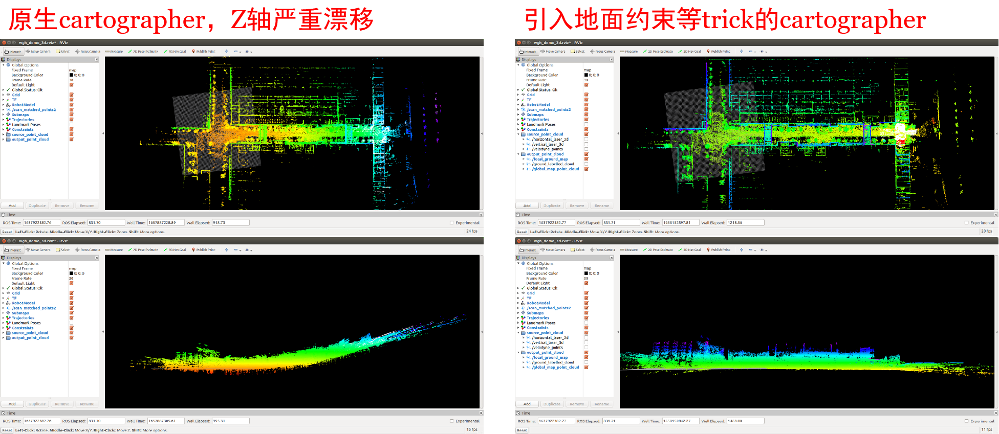

# Ground Aware Cartographer Project
<!-- # ground aware cartographer project -->
## 1. Introduction
This is a **ground aware** version of cartographer(3D) project!

In this project, **ground points are detected and used to construct ground-alignment constraints, which help to get better roll&pitch estimate**.   
To be more specific, an [efficient online ground segmentation](https://github.com/KennyWGH/efficient_online_segmentation) method is adopted to detect ground points for each scan, and a local map of ground points is maintained with [ikd-Tree](https://github.com/hku-mars/ikd-Tree) [(中文解析)](https://zhuanlan.zhihu.com/p/529926254) structure. During the correlative scan match, a scan-to-submap alignment is first conducted to adjust x, y, z and yaw, then a scan-to-local map manner ground plane alignment is conducted to optimize roll and pitch.  

The performance of ground_aware_cartographer has been verified, the gif below shows the result of a 200*100 square meters dataset.  

**It is important to realize that taking ground constraint into consideration do help to reduce Z drift!**  See the picture below: the original Google cartographer suffers from severe z drift when passing through a valley-like area, while ground_aware_cartographer does not have that problem.  

Picture below shows how local map works in low playback speed: it only contain ground pionts of nearby key frames, and always move with robot. With the help of ikd-Tree, maintaining such a local map is not expensive at all.  

## 2. Dependencies
Please follow the official guidelines ([Compiling Cartographer ROS](https://google-cartographer-ros.readthedocs.io/en/latest/compilation.html)) to install dependencies, since this project was developed totally based on the [official Google Cartographer project](https://github.com/cartographer-project/cartographer_ros).  
Note That this project was developed and tested on **ubuntu 16.04** only, so you are highly recommended to use the same ubuntu distribution.

## 3. Compile & Run

### Compile
Compared with original Google cartographer, compiling ground_aware_cartographer is a little bit different. The source code of cartographer has not been released in this repository, so you need to tell cmake to use pre-compiled cartographer package by appending "-DUSE_THIRDPARTY_CARTOGRAPHER=true".   

    catkin_make_isolated --install --use-ninja -DUSE_THIRDPARTY_CARTOGRAPHER=true 

### Run
Before running the roslaunch command below, you should configure wgh_demo_backpack_3d.launch by yourself.  

    roslaunch cartographer_ros wgh_demo_backpack_3d.launch  

## 4. Availiable Datasets
The ground detection algorithm requires lidar elevation angle info and static transform info, however I haven't provided a way to configure these info yet, so currently ground_aware_cartographer cannot work with any public datasets.  
To successfully run ground_aware_cartographer, you may have to used this home-made dataset: 
[`2022-03-31-04-GateRoadDync.bag`](https://drive.google.com/file/d/1wrM04-mVwFJMTdXUwtQjKLltBJ47Uw5h/view?usp=sharing). Note that this dataset is just a simple sample to run ground_aware_cartographer, while it cannot fully show the performance and advantage of ground_aware_cartographer.  

## 5. TODO
- Support public datasets.